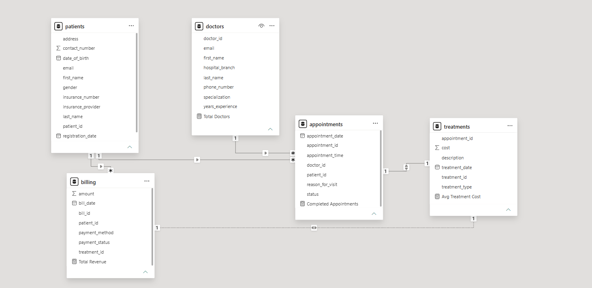

# 🏥 Hospital Patient Analytics System
End-to-End Data Analytics Project using SQL, Python, and Power BI.

## 📌 Project Overview

The Hospital Patient Analytics System is an end-to-end Data Analytics project developed using SQL, Python, and Power BI.

The project focuses on analyzing hospital operational data, monitoring patient information, appointments, treatment costs, revenue, payment methods, and doctor performance through an interactive Power BI dashboard.

The goal is to convert raw healthcare data into meaningful business insights that support better decision-making.

## 📊 Dashboard Preview

## 🎯 Project Objectives

This project was developed to:

- Analyze patient records and hospital operations.
- Monitor appointment status and treatment performance.
- Track hospital revenue and payment methods.
- Compare average treatment costs across treatment types.
- Build an interactive Power BI dashboard for decision-making.
- Demonstrate end-to-end Data Analytics skills using SQL, Python, and Power BI.

## 🛠️ Tech Stack

| Category | Technologies |
|----------|--------------|
| Database | PostgreSQL |
| Programming Language | Python |
| Data Processing | Pandas, NumPy |
| Data Visualization | Power BI |
| Data Source | CSV (.csv) |
| IDE / Tools | VS Code, Jupyter Notebook, Power BI Desktop, pgAdmin 4 |
| Version Control | Git & GitHub |

## 📂 Dataset Information

The Hospital Patient Analytics System uses a relational healthcare dataset stored in PostgreSQL. The dataset contains information about patients, doctors, appointments, treatments, and billing records. The data was processed using Python and visualized using Power BI.

### Database Tables

| Table | Description |
|--------|-------------|
| Patients | Stores patient personal and contact information. |
| Doctors | Contains doctor details, specialization, and experience. |
| Appointments | Maintains appointment date, time, status, and reason for visit. |
| Treatments | Stores treatment type, treatment date, description, and cost. |
| Billing | Contains billing amount, payment method, and payment status. |

**Database:** PostgreSQL

**Data Processing:** Python (Pandas & NumPy)

**Visualization:** Power BI

**File Format:** CSV (.csv)

## 🗄️ Database Schema

The project follows a relational database design in PostgreSQL. The schema consists of five interconnected tables that manage patient, doctor, appointment, treatment, and billing information.

### Data Model

## 💻 SQL Implementation

PostgreSQL was used to design and manage the relational database for the Hospital Patient Analytics System. SQL was used to create tables, establish relationships, retrieve data, and generate analytical insights for reporting.

### SQL Operations Performed

- Created relational database tables using PostgreSQL.
- Defined Primary Key and Foreign Key relationships.
- Retrieved records using `SELECT` statements.
- Performed `INNER JOIN` operations across multiple tables.
- Used Aggregate Functions (`COUNT`, `SUM`, `AVG`) for KPI calculations.
- Applied `GROUP BY` for data summarization.
- Sorted results using `ORDER BY`.
- Filtered records using `WHERE` conditions.
- Used `DISTINCT` to identify unique values.
- Applied column aliases using `AS` for better readability.
