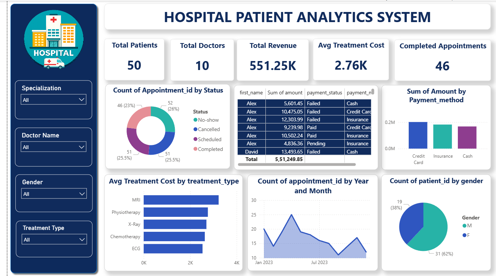

# 🏥 Hospital Patient Analytics System
End-to-End Data Analytics Project using SQL, Python, and Power BI.

## 📌 Project Overview

The Hospital Patient Analytics System is an end-to-end Data Analytics project developed using SQL, Python, and Power BI.

The project focuses on analyzing hospital operational data, monitoring patient information, appointments, treatment costs, revenue, payment methods, and doctor performance through an interactive Power BI dashboard.

The goal is to convert raw healthcare data into meaningful business insights that support better decision-making.

## 📊 Dashboard Preview

